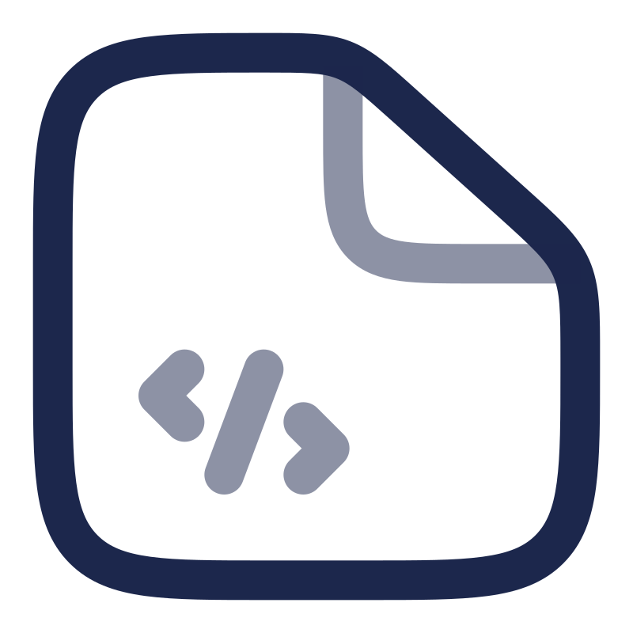

<div align="left">
  
</div>


<!-- <h1> Concurrent APIs    </h1> -->

<!-- [](https://www.npmjs.org/package/arcologynetwork)
[](https://doc.arcology.network/arcology-concurrent-programming-guide/)
[](https://www.arcology.network) -->

<h1> Concurrent APIs   </h1>

<!-- # Concurrent APIs -->

Solidity, the programming language used to develop smart contracts on the Ethereum platform, was not initially designed for concurrent use, so it does not include the features and capabilities necessary for efficient concurrent programming. 

[Arcology Network](https://arcology.network) offers a suite of Solidity APIs customized for concurrent programming tasks. This package includes the Solidity APIs for  smart contract developers to fully utilize the power of **Arcology's parallel execution** capabilities. 

>>Please be aware that all the libraries in the package are specifically designed for Arcology Network only.

<h2> Installation   </h2>

``` shell
$ npm install arcologynetwork/concurrentlib
```

<h2> Usage   </h2>

Once installed, you can use the contracts in the library by importing them.

### Example

The following example demonstrates how to use the concurrentlib to parallelize a simple smart contract. Arcology has a set of concurrent data structures and variables that allow concurrent manipulations. Below is an example of that. 

#### Simple Contract

The following example of a simple smart contract that allows users to like a post. A simplest version of the contract is shown below. When a calls the `like()` function, the `likes` of the receiver is incremented by 1.

This implementation doesn't support concurrent execution. If multiple users call the `like()` function concurrently, the `likes` of the receiver will be incremented concurrently. This is not allowed in Solidity.

```solidity
contract Like {
    uint public likes;

    function like() public {
        likes += 1;
    }    
}
```

#### Parallelized Version

In the parallelized version, the `likes` is replaced with a `U256Cumulative` variable from the `arcologynetwork/contracts/concurrentlib/commutative/U256Cum.sol` library. The variable allows concurrent increment and decrement operations. Now, the `like()` function can be called concurrently by multiple users.

```solidity
import "arcologynetwork/contracts/concurrentlib/commutative/U256Cum.sol";

contract Like {
    U256Cumulative public likes;

    function like() public {
        likes.add(1);
    }    
}
```

<h2> Learn More    </h2>

You can find more examples in the [developer's guide](https://doc.arcology.network/arcology-concurrent-programming-guide/).

<h2> License    </h2>

Arcology's concurrent lib is released under the MIT License.

<h2> Disclaimer    </h2>

Arcology's concurrent lib is made available under the MIT License, which disclaims all warranties in relation to the project and which limits the liability of those that contribute and maintain the project. You acknowledge that you are solely responsible for any use of the Contracts and you assume all risks associated with any such use.
