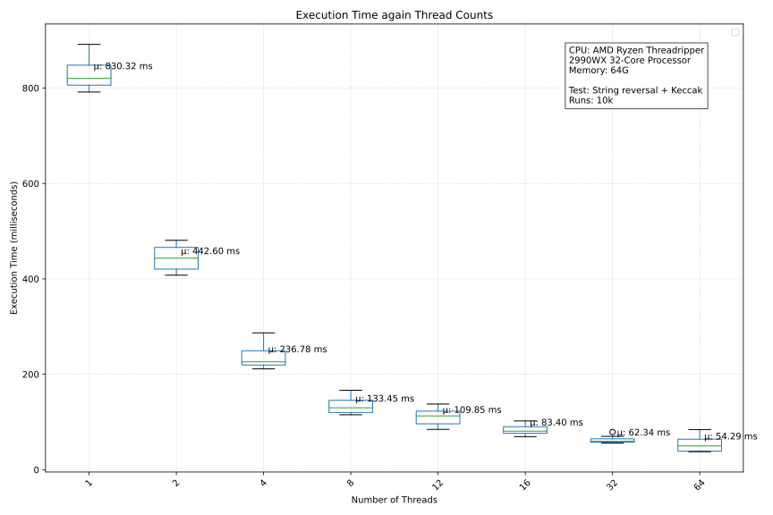

# Concurrent Lib 
This repository contains a set of Solidity API that implement concurrent container functionalities. These contracts are designed for the Arcology network, utilizing its parallel execution design to enable concurrent operations on data structures. They serve as gateways for Solidity smart contract developers to fully utilize the power of Arcology's concurrent execution capabilities.

# 1. Contracts
- **Base:** Serves as the foundation for concurrent container contracts, providing essential functionalities for managing data in a concurrent environment.
- **U256Map:** A concurrent container with key-value lookup using uint256 keys.
-** U256Set:** Derived from U256Map, it implements a set-like data structure for uint256 values.
- **Address:** A concurrent container with key-value lookup using address keys.
- **Bool:** A concurrent container with key-value lookup using bool keys.
- **Bytes:** A concurrent container with key-value lookup using bytes keys.
- **Bytes32:** A concurrent container with key-value lookup using bytes32 keys.
- **Int256:** A concurrent container with key-value lookup using int256 keys.
- **String:** A concurrent container with key-value lookup using string keys.
- **U256:** A concurrent container with key-value lookup using uint256 keys.
- **U256Cumulative:** An integer designed for cumulative operations in full concurrency, with minimum and maximum bounds. Allows concurrent delta changes while ensuring thread safety. 
- **Multiprocess:** A container that allows pushing executable messages and running them in parallel. Utilizes the Arcology parallel execution design for concurrent processing.
- **Runtime:** Provides runtime information to developers, including pseudo process IDs and random numbers, leveraging the power of Arcology's parallel execution model.

# 2. Examples

There are two examples  U256ParaCompute and CumulativeU256ParaCompute, demonstrate the use of the Multiprocess and cumulative u256 libraries together.

## 2.1. U256ParaCompute:
In this contract, there is a variable num which is initially set to 0. The `calculate()` function uses the Multiprocess library to execute two calls to the `add(uint256)` function in parallel. The add function increments the num variable by the given element. After the parallel execution, the contract checks if num is equal to 2, which should be the case because the two `add(uint256)` functions were executed in parallel, both adding 2 to the num variable.

```js
contract U256ParaCompute {
    uint256 num = 0;

    function calculate() public {     
        Multiprocess mp = new Multiprocess(2);  // Create Multiprocess instance with 2 threads         
        mp.push(200000, address(this), abi.encodeWithSignature("add(uint256)", 2)); 
        mp.push(200000, address(this), abi.encodeWithSignature("add(uint256)", 2));
        mp.run(); 					            // Call the functions in parallel
        require(num == 2);                      // Ensure that the 'num' variable is 2
    }

    function add(uint256 elem) public {         // Perform addition to the 'num' variable
        num += elem;
    }  
}
```

##  2.2. CumulativeU256ParaCompute:
This contract uses the U256Cumulative concurrent container from the library, which allows cumulative operations in full concurrency. It has both minimum and maximum bounds and allows concurrent delta changes as long as they are not mixed with reads. The `calculate()` function also uses the Multiprocess library to execute two calls to the `add(uint256)` function in parallel. The add function uses the U256Cumulative container to add the given element to the cumulative value. After the parallel execution, the contract checks if the cumulative value stored in the container is equal to 4.

```js
// Example contract using the Multiprocess library and U256Cumulative for cumulative operations
// to perform parallel additions and ensure state consistency
contract CumulativeU256ParaCompute {
    U256Cumulative cumulative = new U256Cumulative(0, 100);  // Concurrent uint256

    function calculate() public {       
        Multiprocess mp = new Multiprocess(2);   // Create Multiprocess instance with 2 threads
        mp.push(200000, address(this), abi.encodeWithSignature("add(uint256)", 2));     
        mp.push(200000, address(this), abi.encodeWithSignature("add(uint256)", 2));   
        mp.run();   							// Call the functions in parallel
        require(cumulative.get() == 4);         // Ensure that the cumulative value is 4
    }

    function add(uint256 elem) public { 
        cumulative.add(elem);                   // Perform addition to the variable
    }  
}
```
##  2.3. Difference:

The main difference between the two contracts is how they handle the concurrent state changes during concurrent execution. In U256ParaCompute, the num variable is a regular state variable, and concurrent execution of the add function results in a race condition where both functions might attempt to update the num variable at the same time. Arcology's concurrency will detect it at runtime and revert the execution of one transtions. As a result, the final value of num only reflects the delta change from one call.

In CumulativeU256ParaCompute, the U256Cumulative container handles concurrent delta changes. It allows concurrent additions and subtractions to the value and prevents any out-of-bounds changes. Therefore, the cumulative value correctly reflects the sum of the two `add()` calls, which is 4.

##  2.4. Conclusion
The difference in results is due to the handling of concurrent state changes. Only the U256Cumulative container ensures thread safety and provides the expected result.


#  3. Benchmark
The benchmark contract [MpBenchmarking](./lib/multiprocess/mp_benchmarking.sol) is designed to test and benchmark the reverse function using different numbers of threads (or cores) for parallel processing. The reverse function in the contract takes a bytes array as input and reverses its contents. It does so by creating a new bytes array called reversed and then iterating through the original input array in reverse order, storing the elements in the reversed array. 

Finally, it calculates the `keccak256` hash of the reversed array, The execution time for each thread count (1, 2, 4, 8, 12, 16, 32, 64) was recorded for each of the 10 repetitions. Statistics (min, max, mean, and standard deviation) were extracted from the test. 

##  3.1. Results


##  3.2. Analysis:
Test case
Decreasing Execution Time with Increasing Threads: As the number of threads increases, the execution time generally decreases. This trend is evident across the different thread counts. 
It suggests that the benchmark benefits from parallelization, and as more threads are utilized, the computation becomes more efficient. While increasing the number of threads initially leads 
to significant reductions in execution time, the rate of improvement starts to slow down as the number of threads increases.

Given that the test machine only has physical 32 cores, adding more threads beyond 32 (e.g., comparing 32 threads and 64 threads) is unlikely to result in significant improvements in 
performance for this specific benchmark. 